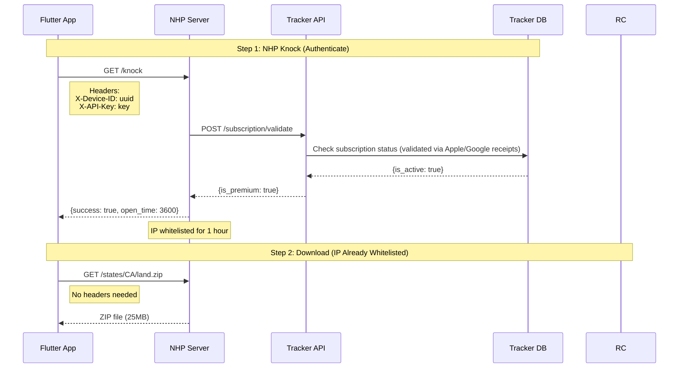
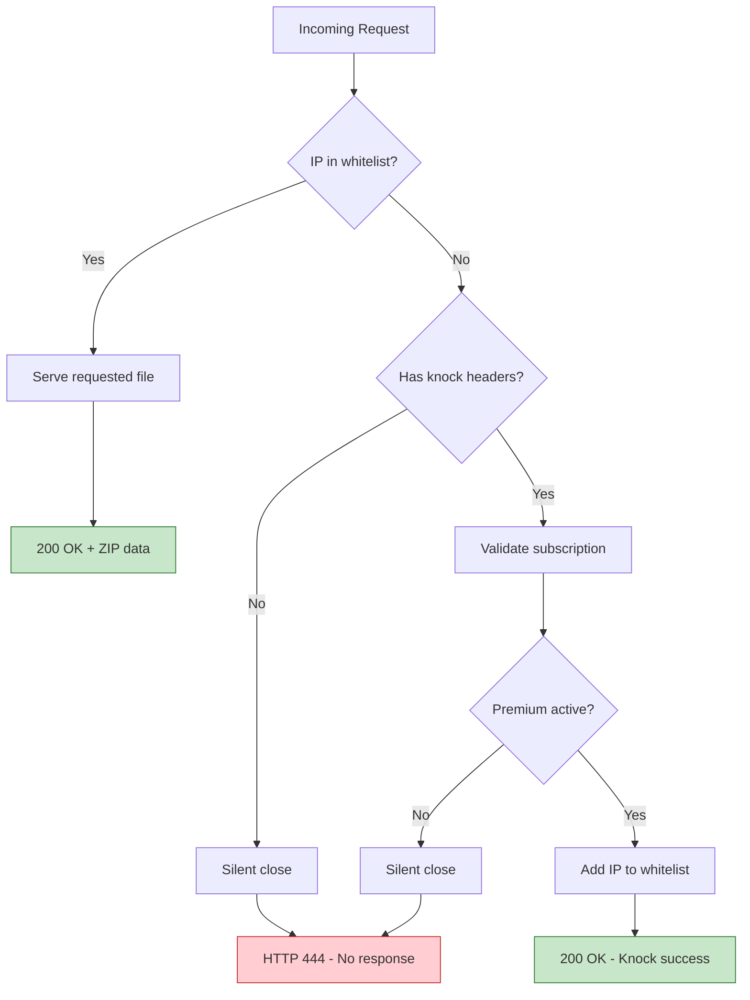

# Security Architecture

## Overview

The Obsession Tracker Flutter app implements comprehensive security measures for
protecting user data and ensuring safe communication with the Tracker API
backend. This document outlines all security measures, build configurations, and
scanning tools.

**Last Updated**: January 2026 **Security Score**: Production-ready for App
Store/Play Store release

---

## Security Layers

```
┌─────────────────────────────────────────────────────────────────────┐
│                  MOBILE APP SECURITY ARCHITECTURE                    │
├─────────────────────────────────────────────────────────────────────┤
│                                                                      │
│  ┌─────────────────────────────────────────────────────────────┐   │
│  │ Layer 1: Network Security                                    │   │
│  │ - HTTPS enforcement (network_security_config.xml)           │   │
│  │ - Certificate pinning ready                                  │   │
│  │ - No cleartext traffic in release                           │   │
│  └─────────────────────────────────────────────────────────────┘   │
│                              │                                       │
│  ┌─────────────────────────────────────────────────────────────┐   │
│  │ Layer 2: Build Security                                      │   │
│  │ - R8 code minification                                       │   │
│  │ - ProGuard obfuscation                                       │   │
│  │ - Debug symbols separated                                    │   │
│  └─────────────────────────────────────────────────────────────┘   │
│                              │                                       │
│  ┌─────────────────────────────────────────────────────────────┐   │
│  │ Layer 3: Data Security                                       │   │
│  │ - SQLCipher encrypted database                               │   │
│  │ - Secure credential storage (Keychain/EncryptedPrefs)       │   │
│  │ - OTX file encryption (AES-256-GCM)                          │   │
│  └─────────────────────────────────────────────────────────────┘   │
│                              │                                       │
│  ┌─────────────────────────────────────────────────────────────┐   │
│  │ Layer 4: Authentication                                      │   │
│  │ - Per-device API keys                                        │   │
│  │ - Secure key storage                                         │   │
│  │ - Key refresh on failure                                     │   │
│  └─────────────────────────────────────────────────────────────┘   │
│                              │                                       │
│  ┌─────────────────────────────────────────────────────────────┐   │
│  │ Layer 5: NHP Invisibility (Premium Downloads)                │   │
│  │ - OpenNHP Zero Trust authentication                          │   │
│  │ - Server invisible to non-subscribers                        │   │
│  │ - IP-based whitelist with 1-hour expiry                     │   │
│  └─────────────────────────────────────────────────────────────┘   │
│                                                                      │
└─────────────────────────────────────────────────────────────────────┘
```

---

## CI/CD Security Scanning

### GitHub Actions Workflow

The security scanning workflow (`.github/workflows/security.yml`) runs:

- On every push to `main` or `develop`
- On every pull request to `main` or `develop`
- Weekly on Sundays (scheduled scan)
- Manually via workflow dispatch

### Scanners

| Scanner                  | Purpose                         | Frequency     |
| ------------------------ | ------------------------------- | ------------- |
| **flutter pub audit**    | Dart dependency vulnerabilities | Every push/PR |
| **TruffleHog**           | Secret detection in commits     | Every push/PR |
| **Custom API Key Check** | Hardcoded secrets detection     | Every push/PR |
| **flutter analyze**      | Static analysis                 | Every push/PR |
| **APKLeaks**             | APK secret scanning             | On main push  |

### Scanner Configuration

#### flutter pub audit

Checks Dart dependencies against security advisories:

```bash
flutter pub audit
```

Reports any known vulnerabilities in dependencies.

#### TruffleHog Secret Detection

Scans commits for exposed secrets:

- PR scans: Compares base to head SHA
- Push scans: Scans since previous commit
- Only reports verified secrets (reduces false positives)

#### Custom API Key Check

Scans source files for:

- Mapbox public tokens (`pk.eyJ`)
- Mapbox secret tokens (`sk.eyJ`) - **fails build**
- Hardcoded API keys matching common patterns

---

## Android Security

### Network Security Configuration

File: `android/app/src/main/res/xml/network_security_config.xml`

```xml
<?xml version="1.0" encoding="utf-8"?>
<network-security-config>
    <!-- Enforce HTTPS for production API -->
    <domain-config cleartextTrafficPermitted="false">
        <domain includeSubdomains="true">obsessiontracker.com</domain>
        <domain includeSubdomains="true">api.obsessiontracker.com</domain>
    </domain-config>

    <!-- Default: no cleartext -->
    <base-config cleartextTrafficPermitted="false">
        <trust-anchors>
            <certificates src="system" />
        </trust-anchors>
    </base-config>

    <!-- Debug builds allow localhost -->
    <debug-overrides>
        <trust-anchors>
            <certificates src="user" />
            <certificates src="system" />
        </trust-anchors>
    </debug-overrides>
</network-security-config>
```

### R8/ProGuard Configuration

File: `android/app/build.gradle.kts`

```kotlin
release {
    isMinifyEnabled = true
    isShrinkResources = true
    proguardFiles(
        getDefaultProguardFile("proguard-android-optimize.txt"),
        "proguard-rules.pro"
    )
    isDebuggable = false
}
```

### ProGuard Rules

File: `android/app/proguard-rules.pro`

Protected libraries:

- Flutter framework
- SQLCipher (encrypted database)
- Mapbox SDK
- HTTP client
- Crypto libraries

---

## iOS Security

### App Transport Security

iOS enforces HTTPS by default. The app respects ATS with no exceptions for
production domains.

### Keychain Storage

API keys are stored in the iOS Keychain using `flutter_secure_storage`:

- Hardware-backed encryption on supported devices
- Biometric protection available
- Survives app reinstalls (optional)

---

## Data Security

### Split Encryption Strategy

The app uses a **split encryption strategy** to balance security and
performance:

| Database               | Encryption              | Contents                                                               |
| ---------------------- | ----------------------- | ---------------------------------------------------------------------- |
| `obsession_tracker.db` | **AES-256 (SQLCipher)** | User data: sessions, waypoints, photos metadata, hunts, routes         |
| `land_cache.db`        | **None**                | Public data: PAD-US land ownership, OSM trails, GNIS historical places |

**Why public data is unencrypted:**

- The land cache contains only **publicly available government data** (usgs.gov,
  openstreetmap.org)
- Encrypting public data added 10-20% performance overhead on map queries
- User's personal data (treasure locations, tracks, photos) remains fully
  encrypted

### User Data Encryption (SQLCipher)

User data is encrypted using SQLCipher via `sqflite_sqlcipher`:

```dart
// User database opened with encryption key
final db = await openDatabase(
  path,
  password: encryptionKey,  // AES-256 encryption
);
```

Key derivation:

- Device-unique key material
- Stored in iOS Keychain / Android KeyStore
- AES-256 encryption

### What's Protected

| Data Type         | Storage              | Encrypted?       |
| ----------------- | -------------------- | ---------------- |
| Hunt sessions     | obsession_tracker.db | ✅ AES-256       |
| GPS breadcrumbs   | obsession_tracker.db | ✅ AES-256       |
| Waypoints         | obsession_tracker.db | ✅ AES-256       |
| Photo metadata    | obsession_tracker.db | ✅ AES-256       |
| Voice notes       | obsession_tracker.db | ✅ AES-256       |
| Routes            | obsession_tracker.db | ✅ AES-256       |
| Land ownership    | land_cache.db        | ❌ Public data   |
| Trails            | land_cache.db        | ❌ Public data   |
| Historical places | land_cache.db        | ❌ Public data   |
| App settings      | SharedPreferences    | ❌ Non-sensitive |

### OTX File Encryption

Session export format uses military-grade encryption:

| Component      | Specification               |
| -------------- | --------------------------- |
| Algorithm      | AES-256-GCM                 |
| Key Derivation | PBKDF2 (600,000 iterations) |
| Salt           | 32 bytes random             |
| Nonce          | 12 bytes random             |

See: [OTX File Encryption](../docs/OTX_FILE_ENCRYPTION.md)

### Secure Credential Storage

| Platform | Storage Method             |
| -------- | -------------------------- |
| iOS      | Keychain Services          |
| Android  | EncryptedSharedPreferences |

Stored credentials:

- Tracker API key
- Device registration ID
- User preferences (encrypted)

---

## API Client Security

### HTTP Configuration

File: `lib/core/services/bff_mapping_service.dart`

```dart
// HTTP client with timeout
final client = http.Client();
// 30-second request timeout
```

Features:

- 30-second HTTP timeout
- Large response streaming (prevents memory issues)
- 401 Unauthorized detection
- Automatic retry on failure

### API Key Authentication

```dart
final headers = {
  'X-API-Key': apiKey,
  'Content-Type': 'application/json',
};
```

All protected API requests include the `X-API-Key` header.

---

## NHP Invisibility (Premium Downloads)

Premium offline map downloads use OpenNHP (Network-resource Hiding Protocol) for
Zero Trust authentication. The download server is "invisible" to
non-subscribers - they cannot even detect its existence.

### How NHP Invisibility Works

1. **Non-authenticated requests**: Connection silently closed (HTTP 444)
2. **Invalid subscription**: Connection silently closed (HTTP 444)
3. **Valid premium users**: Files served normally after IP whitelist

Unlike traditional authentication where unauthorized users see a "403 Forbidden"
error, NHP returns **nothing** - the connection is closed silently. Port
scanners and unauthorized users see no response, making the server appear
non-existent.

### NHP Authentication Flow



**Text representation:**

```
Flutter App                    NHP Server                    Tracker API
    │                              │                            │
    ├── GET /knock ────────────────►                            │
    │   X-Device-ID: uuid          │                            │
    │   X-API-Key: key             │                            │
    │                              ├── POST /subscription/validate ──►
    │                              │   Validate subscription    │
    │                              │◄──────── {is_premium: true} ──┤
    │                              │                            │
    │◄── {success: true} ──────────┤                            │
    │   IP whitelisted for 1 hour  │                            │
    │                              │                            │
    ├── GET /states/CA/land.zip ───►                            │
    │   (No headers needed)        │                            │
    │◄── ZIP file (25MB) ──────────┤                            │
```

### Invisibility Model



**Key insight**: Unauthorized users receive HTTP 444 (silent close) - no
headers, no body, nothing. Port scanners see no service running.

### Security Properties

| Property               | Implementation                                                 |
| ---------------------- | -------------------------------------------------------------- |
| Zero Trust             | Every request validated via subscription check                 |
| Invisibility           | HTTP 444 for unauthorized (no response body)                   |
| Time-limited access    | IP whitelist expires after 1 hour                              |
| Subscription-gated     | tracker-api validates premium status via Apple/Google receipts |
| No credential exposure | API key validated server-side, not stored on download server   |

### NHP Server Configuration

The NHP download server uses nginx with `auth_request` to validate each request:

```nginx
location /states/ {
    auth_request /_auth_check;
    error_page 403 = @invisible;
    # ... serve files
}

location @invisible {
    return 444;  # Silent close - no response
}
```

### Flutter Integration

**NhpDownloadService** (`lib/core/services/nhp_download_service.dart`):

- HTTP-based knock (no native SDK required)
- Caches knock result for 50 minutes (safety margin on 1-hour whitelist)
- Feature flag `nhpDownloadsEnabled` for gradual rollout

### Threat Model

| Threat                | Mitigation                                                  |
| --------------------- | ----------------------------------------------------------- |
| Unauthorized download | Server invisible without valid subscription                 |
| API key theft         | Key only used for knock, not stored on download server      |
| IP spoofing           | Whitelist tied to knock, short expiry (1 hour)              |
| Subscription bypass   | Server-side Apple/Google receipt validation via tracker-api |
| Brute force           | No response to invalid requests (no timing oracle)          |

---

## Build Security

### Debug vs Release

| Feature           | Debug               | Release   |
| ----------------- | ------------------- | --------- |
| Cleartext traffic | Allowed (localhost) | Blocked   |
| Obfuscation       | Disabled            | Enabled   |
| Minification      | Disabled            | Enabled   |
| Debug symbols     | Included            | Separated |
| Logging           | Verbose             | Minimal   |

### Obfuscation

Release builds use Flutter's obfuscation:

```bash
flutter build apk --release \
  --obfuscate \
  --split-debug-info=build/app/outputs/symbols
```

Debug symbols are:

- Uploaded to Firebase Crashlytics (if enabled)
- Stored separately for symbolication
- Never included in release APK/IPA

---

## Security Scanning Jobs

### Flutter Security Audit

Checks dependencies against dart.dev security advisories:

```yaml
- name: Run flutter pub audit
  run: flutter pub audit
```

### Static Analysis

Security-focused lint checks:

```yaml
- name: Run Flutter Analyze (strict)
  run: flutter analyze --fatal-infos
```

### Custom Security Checks

```yaml
# Check for print() statements (info leakage)
grep -r "print(" lib/ | wc -l

# Check for security-related TODOs
grep -rE "(TODO|FIXME).*(security|auth|encrypt)"
```

### APK Analysis (Main Branch Only)

```yaml
- name: Scan APK for secrets
  run: apkleaks -f "$APK_PATH"
```

---

## Environment Security

### Development

- Localhost API allowed
- Debug logging enabled
- User certificates trusted
- Cleartext to localhost permitted

### Production

- HTTPS only
- System certificates only
- Minimal logging
- No cleartext traffic

---

## Secret Management

### What's NOT in Source Control

- API keys
- Signing certificates
- OAuth credentials
- Mapbox secret tokens

### What's Safe in Source Control

- Mapbox public tokens (pk.\*)
- App bundle identifiers
- Public configuration

### GitHub Secrets (CI/CD)

| Secret                | Purpose         |
| --------------------- | --------------- |
| `MAPBOX_SECRET_TOKEN` | SDK downloads   |
| `APPLE_CERTIFICATES`  | iOS signing     |
| `ANDROID_KEYSTORE`    | Android signing |

---

## Security Checklist

### Pre-Release

- [x] R8 minification enabled
- [x] ProGuard obfuscation configured
- [x] Network security config implemented
- [x] HTTPS enforcement
- [x] CI/CD security scanning
- [x] Secret detection in pipeline
- [x] SQLCipher database encryption
- [x] Secure credential storage
- [x] API key authentication

### Monitoring

- [ ] Crashlytics security events (planned)
- [ ] Failed auth tracking (planned)
- [ ] Anomaly detection (planned)

---

## Related Documentation

- [Architecture](architecture.md) - System architecture
- [Tracker API Integration Guide](api-integration-guide.md) - Backend security
- [API Keys and Services](api_keys_and_services.md) - Credential management
- [Development Guidelines](development-guidelines.md) - Secure coding practices

---

_Document created: December 2025_ _Security architecture implemented: December
2025_
