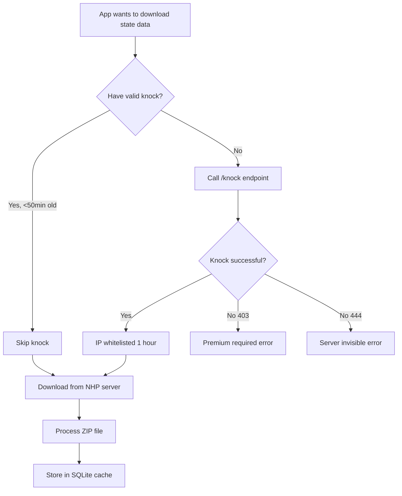

# API Integration Guide

**Last Updated**: January 2026

This guide shows how to integrate the Flutter app with the Tracker API (REST)
and NHP-protected download server for land rights and state data.

## Architecture Overview

```
Flutter App
    │
    ├── REST API (with API key auth)
    │       ↓
    │   Tracker API (api.obsessiontracker.com)
    │       ↓
    │   ┌─────────────────┬─────────────────┐
    │   │ SQLite Database │ Apple/Google     │
    │   │ (App Data)      │ Receipt Validation│
    │   └─────────────────┴──────────────────┘
    │
    └── NHP Downloads (premium subscribers)
            ↓
        OpenNHP Server (downloads.obsessiontracker.com)
            ↓
        ┌─────────────────────────────────┐
        │ DigitalOcean Droplet            │
        │ (State ZIP files - 1.7GB)       │
        └─────────────────────────────────┘
```

## Prerequisites

1. **Flutter**: Version 3.16.0 or higher
2. **API Key**: Device auto-registers on first launch

## Service Architecture

The Tracker API runs on the DigitalOcean droplet as a Docker container:

- **Express.js API**: TypeScript REST API (port 3003)
- **SQLite**: Local database for app data (devices, hunts, announcements)
- **Local Filesystem**: State ZIP files stored on droplet

**Deployment**: Via `deploy-droplet.yml` GitHub Actions workflow.

## API Authentication

### Device Registration Flow

1. App checks for stored API key on launch
2. If no key exists, registers device with Tracker API
3. API returns a unique 256-bit API key
4. App stores key in secure storage (Keychain/EncryptedPrefs)
5. All subsequent API requests include `X-API-Key` header

### Flutter Implementation

**DeviceRegistrationService**
(`lib/core/services/device_registration_service.dart`):

- Handles device registration with Tracker API
- Stores API key securely using flutter_secure_storage
- Provides key for API requests

### Endpoint Configuration

| Environment | URL                              |
| ----------- | -------------------------------- |
| Production  | https://api.obsessiontracker.com |
| Development | http://localhost:3003            |

**BFFConfig** (`lib/core/config/bff_config.dart`) manages endpoint selection.

**Note**: API keys are endpoint-specific. Switching endpoints requires
re-registration.

## Flutter Services

### Key Files

1. **DeviceRegistrationService**
   (`lib/core/services/device_registration_service.dart`)
   - Manages device registration with API
   - Secure API key storage
   - Respects user's endpoint selection

2. **BFFMappingService** (`lib/core/services/bff_mapping_service.dart`)
   - Handles state data downloads
   - Manages land ownership data
   - Converts API responses to Flutter models

3. **BFFConfig** (`lib/core/config/bff_config.dart`)
   - Endpoint URL management
   - Environment detection

4. **DynamicLandDataService**
   (`lib/core/services/dynamic_land_data_service.dart`)
   - Orchestrates state ZIP downloads
   - Manages offline data cache

## REST API Endpoints

### Health Check

```http
GET /health
```

No authentication required.

### Device Registration

```http
POST /api/v1/devices/register
Content-Type: application/json

{
  "device_id": "uuid-from-device",
  "platform": "ios",
  "app_version": "1.4.0"
}
```

Response:

```json
{
  "api_key": "hex-256-bit-key",
  "device_id": "uuid-from-device"
}
```

### Subscription Validation

```http
POST /api/v1/subscription/validate
X-API-Key: your-api-key
X-Device-ID: device-uuid
```

Response:

```json
{
  "is_premium": true,
  "entitlements": {
    "premium": { "is_active": true }
  },
  "expires_at": "2026-12-31T23:59:59Z"
}
```

### List Available States

```http
GET /api/v1/downloads/states
X-API-Key: your-api-key
```

Response:

```json
{
  "states": [
    {
      "code": "CA",
      "name": "California",
      "sizeBytes": 30000000,
      "parcelCount": 25000,
      "lastUpdated": "2025-12-01T00:00:00Z"
    }
  ],
  "dataVersion": "PAD-US 4.1"
}
```

### Download Metadata

```http
GET /api/v1/downloads/metadata
X-API-Key: your-api-key
```

Returns size information for all states and data types.

---

## NHP Downloads (Premium - Required)

Premium offline map downloads use OpenNHP (Network-resource Hiding Protocol) for
enhanced security. The download server is "invisible" to non-subscribers.

### NHP Download Flow



**Step-by-step:**

1. App calls `NhpDownloadService.knockForDownloads()` with device credentials
2. NHP server validates subscription via Tracker API
   `/api/v1/subscription/validate`
3. If premium, device's IP is whitelisted for 1 hour
4. App downloads from NHP server directly

### NHP Knock Endpoint

```http
GET https://downloads.obsessiontracker.com/knock
X-Device-ID: device-uuid
X-API-Key: api-key
```

**Success Response** (200):

```json
{
  "success": true,
  "message": "IP whitelisted for downloads",
  "open_time": 3600,
  "expires_in": 3600
}
```

**Subscription Required** (403 or 444):

- Returns 444 (silent close) for invisibility
- Non-subscribers see connection closed, not an error page

### NHP Download Endpoints

After successful knock, download files directly:

```http
GET https://downloads.obsessiontracker.com/states/{STATE}/land.zip
GET https://downloads.obsessiontracker.com/states/{STATE}/trails.zip
GET https://downloads.obsessiontracker.com/states/{STATE}/historical.zip
```

No additional headers required - IP is already whitelisted.

### Flutter Integration

**Key Services:**

1. **NhpDownloadService** (`lib/core/services/nhp_download_service.dart`)
   - HTTP-based NHP knock
   - Knock result caching (50 minutes)
   - URL generation for downloads

2. **BFFMappingService** (`lib/core/services/bff_mapping_service.dart`)
   - Integrates NHP knock before downloads

**Usage Example:**

```dart
// In BFFMappingService.downloadStateDataTypeToDatabase()
final nhpService = NhpDownloadService.instance;

if (apiKey != null && deviceId != null) {
  final knockResult = await nhpService.knockForDownloads(
    deviceId: deviceId,
    apiKey: apiKey,
  );

  if (knockResult.success) {
    // Download from NHP server
    zipUrl = nhpService.getStateDownloadUrl(stateCode, dataType);
  }
}
```

---

## Announcements Integration

The API provides a REST endpoint for in-app announcements.

### Endpoint

```http
GET /announcements
```

**No authentication required** - This is a public endpoint.

### Query Parameters

| Parameter  | Type    | Default | Description                             |
| ---------- | ------- | ------- | --------------------------------------- |
| `limit`    | integer | 50      | Maximum announcements to return (1-100) |
| `platform` | string  | -       | Filter by platform: `ios` or `android`  |

### Response

```json
[
  {
    "id": "uuid",
    "announcement_type": "info",
    "title": "Welcome!",
    "body": "Thank you for joining...",
    "image_url": null,
    "action_type": "open_url",
    "action_value": "https://...",
    "priority": "normal",
    "target_platforms": [],
    "target_min_version": null,
    "published_at": "2025-12-03T12:00:00Z",
    "expires_at": "2026-01-03T12:00:00Z",
    "hunt_id": null
  }
]
```

### Announcement Types

| Type             | Description                 |
| ---------------- | --------------------------- |
| `new_hunt`       | New treasure hunt available |
| `treasure_found` | A treasure was found        |
| `app_update`     | App update available        |
| `land_data`      | Land data updates           |
| `maintenance`    | Scheduled maintenance       |
| `hunt_update`    | Hunt status/clue update     |
| `info`           | General information         |
| `warning`        | Warning notice              |
| `critical`       | Critical alert              |

### Flutter Services

1. **AnnouncementsApiService**
   (`lib/core/services/announcements_api_service.dart`)
   - Fetches announcements from `/announcements` endpoint
   - Handles platform filtering

2. **AnnouncementsProvider** (`lib/core/providers/announcements_provider.dart`)
   - Riverpod state management
   - Local caching with SharedPreferences

## Hunts Integration

### List Hunts

```http
GET /hunts
```

No authentication required. Returns active treasure hunts.

### Hunt Structure

```json
{
  "id": "uuid",
  "title": "The Secret",
  "slug": "the-secret",
  "shortDescription": "A treasure hunt adventure",
  "fullDescription": "Complete details...",
  "prizeValue": "$25,000",
  "status": "active",
  "difficulty": "expert",
  "searchRegion": "United States",
  "providerName": "Jon Collins-Black",
  "providerUrl": "https://treasureinside.com",
  "heroImageUrl": "https://...",
  "thumbnailUrl": "https://...",
  "links": [],
  "media": []
}
```

## State ZIP File Structure

### Split ZIPs

```text
states/CA/
├── land.zip               # PAD-US land ownership
├── trails.zip             # OpenStreetMap trails
└── historical.zip         # GNIS historical places
```

Split downloads allow users to update only the data type that changed.

### land_ownership.json Format

```json
{
  "state_code": "CA",
  "state_name": "California",
  "data_version": "PAD-US 4.1",
  "generated_at": "2025-12-01T00:00:00Z",
  "parcel_count": 25000,
  "parcels": [
    {
      "id": "padus-ca-12345",
      "owner_name": "Angeles National Forest",
      "ownership_type": "FED",
      "managing_agency": "USFS",
      "acreage": 700000,
      "activity_permissions": {
        "metal_detecting": "PERMIT_REQUIRED",
        "treasure_hunting": "PERMIT_REQUIRED"
      },
      "boundaries": {
        "type": "MultiPolygon",
        "coordinates": [[[[...]]]]
      }
    }
  ]
}
```

## Production Deployment

### Endpoints

| Service         | URL                                     |
| --------------- | --------------------------------------- |
| Production API  | https://api.obsessiontracker.com        |
| Health Check    | https://api.obsessiontracker.com/health |
| Downloads (NHP) | https://downloads.obsessiontracker.com  |
| Development     | http://localhost:3003                   |

### Deployment

The Tracker API deploys to the DigitalOcean droplet via GitHub Actions
(`deploy-droplet.yml`). It runs as a Docker container alongside other services.

## Local Development

### Running Tracker API

```bash
cd obsession-tracker/server
npm install
npm run dev
# API available at http://localhost:3003
```

### Flutter Development

Configure Flutter app to use `http://localhost:3003` or `http://10.0.2.2:3003`
for Android emulator.

## Troubleshooting

### Authentication Issues

**401 Unauthorized responses:**

1. Check if device is registered: Look for API key in logs
2. Verify API key header: `X-API-Key` must be present
3. Check endpoint matches registration: Key is endpoint-specific

**Re-registration:**

```dart
// Clear stored key and re-register
await DeviceRegistrationService.instance.clearRegistration();
// Restart app
```

### Connection Issues

**Cannot reach API:**

1. Check production endpoint: `curl https://api.obsessiontracker.com/health`
2. Check local dev: `curl http://localhost:3003/health`
3. Verify API key is valid

### State Download Issues

**ZIP download fails:**

1. Check subscription is active (premium required for downloads)
2. Verify NHP knock succeeded
3. Check network connectivity
4. Check device storage space

**Large state sizes:**

- Small states (WY, MT): 5-10 MB
- Medium states (CO, OR): 10-20 MB
- Large states (CA, TX): 25-35 MB

---

_Last Updated: January 2026_
