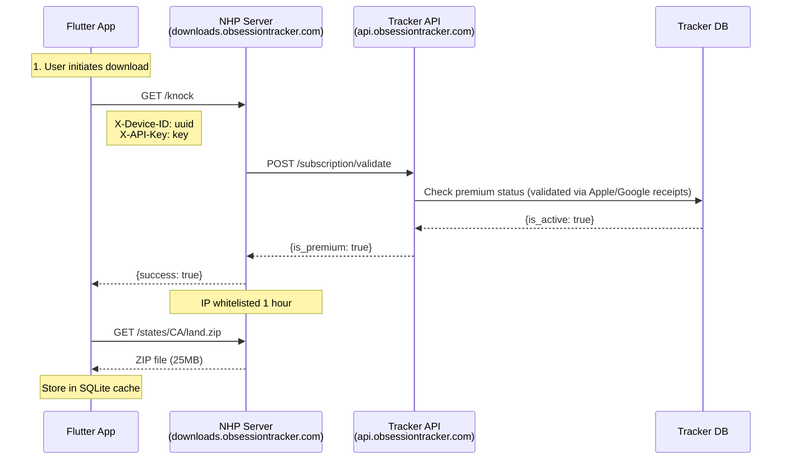

# Obsession Tracker - Technical Architecture

## Overview

Obsession Tracker is a privacy-first GPS tracking application built with
Flutter, designed for treasure hunters, explorers, and adventurers. The
architecture prioritizes offline functionality, local data storage, and user
privacy.

## System Architecture

### Core Technology Stack

- **Framework**: Flutter 3.x
- **Database**: SQLite with SQLCipher encryption
- **Maps**: Mapbox Maps Flutter SDK with native offline support
- **State Management**: Riverpod
- **Location Services**: geolocator package
- **Storage**: sqflite for structured data, path_provider for file storage
- **Backend**: Express.js REST API on Droplet (api.obsessiontracker.com)
- **Premium Downloads**: OpenNHP-protected server
  (downloads.obsessiontracker.com)
- **Authentication**: Per-device API keys + NHP subscription validation

### Navigation Architecture

#### Current Implementation (5-Tab Structure)

**App Navigation** (Left to Right Priority):

```
┌─────────────────────────────────────────────────────────┐
│    📍        📋          🔍         🗺️        ⋯        │
│   Track   Sessions    Hunts     Routes     More        │
└─────────────────────────────────────────────────────────┘
```

**Tab 1: Track** (Default Landing)

- Live GPS tracking with interactive map
- Active session controls
- Photo capture FAB (when tracking)
- Land ownership overlay

**Tab 2: Sessions**

- List of completed tracking sessions
- Session detail with playback
- Photo grids and waypoint lists
- Export capabilities

**Tab 3: Hunts**

- Treasure hunt organization and tracking
- Multi-hunt management with status (active, paused, solved, abandoned)
- Document storage, potential solve locations, session linking

**Tab 4: Routes**

- Planned route library
- GPX/KML import
- Route vs. session comparison

**Tab 5: More** (Flat Structure)

- SETTINGS: Security, General, Accessibility, GPS, Map, Offline Data, Advanced
- COMMUNITY: Discord Server, Help & Support
- ABOUT: About, Licenses

**Design Philosophy**:

- **Flat hierarchy**: All settings visible at once, no drill-down
- **Section headers**: Clear visual organization (SETTINGS, COMMUNITY, ABOUT)
- **One-tap access**: Every setting/feature accessible with single tap
- **Map-first**: Users land on the most useful screen (Track)
- **Session-centric**: Photos and waypoints are session components, not
  standalone

#### Responsive Navigation

**Phone** (Portrait): Bottom navigation bar (5 tabs) **Tablet** (Landscape):
Navigation rail with icons + labels **Desktop**: Extended navigation rail with
full labels

### Architecture Patterns

#### Clean Architecture Layers

```
presentation/     # UI widgets and screens
├── screens/     # Individual app screens
├── widgets/     # Reusable UI components
└── providers/   # State management

domain/          # Business logic
├── entities/    # Core data models
├── usecases/    # Business operations
└── repositories/ # Abstract data contracts

data/            # Data access layer
├── models/      # Data transfer objects
├── datasources/ # Local/remote data sources
└── repositories/ # Repository implementations

core/            # Shared utilities
├── constants/   # App constants
├── utils/       # Helper functions
└── services/    # Platform services
```

#### Data Flow

1. **UI Layer** triggers user actions
2. **Provider/Notifier** manages state changes
3. **Use Cases** handle business logic
4. **Repository** abstracts data access
5. **Data Sources** interact with SQLite/file system

### Database Schema

#### Core Tables (Schema v5)

```sql
-- Tracking sessions
CREATE TABLE sessions (
    id TEXT PRIMARY KEY,
    name TEXT NOT NULL,
    description TEXT,
    status TEXT NOT NULL,
    created_at INTEGER NOT NULL,
    started_at INTEGER,
    completed_at INTEGER,
    total_distance REAL NOT NULL DEFAULT 0.0,
    total_duration INTEGER NOT NULL DEFAULT 0,
    breadcrumb_count INTEGER NOT NULL DEFAULT 0,
    accuracy_threshold REAL NOT NULL DEFAULT 10.0,
    recording_interval INTEGER NOT NULL DEFAULT 5,
    start_latitude REAL,
    start_longitude REAL,
    end_latitude REAL,
    end_longitude REAL,
    minimum_speed REAL NOT NULL DEFAULT 0.0,
    record_altitude INTEGER NOT NULL DEFAULT 1,
    record_speed INTEGER NOT NULL DEFAULT 1,
    record_heading INTEGER NOT NULL DEFAULT 1,
    planned_route_id TEXT,           -- Optional route being followed
    planned_route_snapshot TEXT,      -- JSON snapshot of route data
    elevation_gain REAL NOT NULL DEFAULT 0.0,
    elevation_loss REAL NOT NULL DEFAULT 0.0,
    max_altitude REAL,
    min_altitude REAL,
    max_speed REAL,
    hunt_id TEXT                      -- Optional associated hunt
);

CREATE INDEX idx_sessions_hunt_id ON sessions (hunt_id);

-- GPS breadcrumb points
CREATE TABLE breadcrumbs (
    id TEXT PRIMARY KEY,
    session_id TEXT NOT NULL,
    latitude REAL NOT NULL,
    longitude REAL NOT NULL,
    altitude REAL,
    accuracy REAL NOT NULL,
    speed REAL,
    heading REAL,
    timestamp INTEGER NOT NULL,
    FOREIGN KEY (session_id) REFERENCES sessions (id) ON DELETE CASCADE
);

-- Waypoints and markers
CREATE TABLE waypoints (
    id TEXT PRIMARY KEY,
    session_id TEXT NOT NULL,
    latitude REAL NOT NULL,
    longitude REAL NOT NULL,
    type TEXT NOT NULL,
    timestamp INTEGER NOT NULL,
    name TEXT,
    notes TEXT,
    altitude REAL,
    accuracy REAL,
    speed REAL,
    heading REAL,
    FOREIGN KEY (session_id) REFERENCES sessions (id) ON DELETE CASCADE
);

-- Photo waypoints (Milestone 3)
CREATE TABLE photo_waypoints (
    id TEXT PRIMARY KEY,
    waypoint_id TEXT NOT NULL,
    file_path TEXT NOT NULL,
    thumbnail_path TEXT,
    created_at INTEGER NOT NULL,
    file_size INTEGER NOT NULL DEFAULT 0,
    width INTEGER,
    height INTEGER,
    FOREIGN KEY (waypoint_id) REFERENCES waypoints (id) ON DELETE CASCADE
);

-- Photo metadata (Milestone 3)
CREATE TABLE photo_metadata (
    id INTEGER PRIMARY KEY AUTOINCREMENT,
    photo_waypoint_id TEXT NOT NULL,
    key TEXT NOT NULL,
    value TEXT,
    type TEXT NOT NULL DEFAULT 'string',
    FOREIGN KEY (photo_waypoint_id) REFERENCES photo_waypoints (id) ON DELETE CASCADE
);

-- Session statistics
CREATE TABLE session_statistics (
    id INTEGER PRIMARY KEY AUTOINCREMENT,
    session_id TEXT NOT NULL,
    timestamp INTEGER NOT NULL,
    total_distance REAL NOT NULL DEFAULT 0.0,
    segment_distance REAL NOT NULL DEFAULT 0.0,
    total_duration INTEGER NOT NULL DEFAULT 0,
    moving_duration INTEGER NOT NULL DEFAULT 0,
    stationary_duration INTEGER NOT NULL DEFAULT 0,
    current_speed REAL NOT NULL DEFAULT 0.0,
    average_speed REAL NOT NULL DEFAULT 0.0,
    moving_average_speed REAL NOT NULL DEFAULT 0.0,
    max_speed REAL NOT NULL DEFAULT 0.0,
    current_altitude REAL,
    min_altitude REAL,
    max_altitude REAL,
    total_elevation_gain REAL NOT NULL DEFAULT 0.0,
    total_elevation_loss REAL NOT NULL DEFAULT 0.0,
    current_heading REAL,
    waypoint_count INTEGER NOT NULL DEFAULT 0,
    waypoints_by_type TEXT NOT NULL DEFAULT '{}',
    waypoint_density REAL NOT NULL DEFAULT 0.0,
    last_location_accuracy REAL,
    average_accuracy REAL,
    good_accuracy_percentage REAL NOT NULL DEFAULT 0.0,
    FOREIGN KEY (session_id) REFERENCES sessions (id) ON DELETE CASCADE
);
```

### Photo Waypoint Architecture (Milestone 3)

#### Photo Storage System

The photo waypoint system implements a privacy-first architecture with
UUID-based file organization:

```
photos/
├── 2025/
│   ├── 01/
│   │   ├── a1b2c3d4-e5f6-7890-abcd-ef1234567890.jpg
│   │   ├── a1b2c3d4-e5f6-7890-abcd-ef1234567890_thumb.jpg
│   │   └── b2c3d4e5-f6g7-8901-bcde-f23456789012.jpg
```

#### Core Photo Services

- **PhotoStorageService**: Cross-platform app-controlled storage using
  `getApplicationDocumentsDirectory()`, UUID-based file management with session
  organization, automatic cleanup
- **PhotoCaptureService**: Camera integration with EXIF processing and
  geotagging, immediate file storage for preview
- **PhotoLibraryService**: Optional iOS/Android photo library integration (not
  used for primary storage)
- **AssetPhotoImage**: Unified photo display widget with thumbnail support and
  error handling
- **PhotoProvider**: Riverpod state management for photo operations
- **PhotoMetadata**: Flexible key-value storage for extensible metadata

#### Photo Component Architecture

```
PhotoWaypoint System
├── Data Layer
│   ├── PhotoWaypoint Model
│   ├── PhotoMetadata Model
│   └── Database Integration
├── Service Layer
│   ├── PhotoStorageService
│   ├── PhotoCaptureService
│   └── PhotoProvider (State Management)
└── Presentation Layer
    ├── AssetPhotoImage (Core display widget)
    ├── PhotoGalleryWidget
    ├── PhotoGalleryPage
    ├── PhotoViewerPage
    ├── EnhancedPhotoViewerPage
    ├── PhotoMarker (Map Integration)
    ├── Session Detail Photo Grid
    └── PhotoStorageManagerWidget
```

#### Responsive Design System

The photo system includes comprehensive responsive design for tablet
optimization:

- **Adaptive Breakpoints**: Mobile (600px), Tablet (900px), Desktop (1200px)
- **Master-Detail Layouts**: Photo list sidebar with large viewer area
- **Platform-Specific Optimizations**: iPad split-screen, Android multi-window
- **Touch Optimizations**: Gesture-based navigation, pinch-to-zoom

#### Privacy and Security Features

- **UUID File Naming**: Prevents accidental data exposure through file names
- **Location Fuzzing**: Configurable precision reduction for privacy
- **EXIF Stripping**: Remove sensitive metadata for sharing
- **Local Storage**: No cloud dependencies for core functionality
- **Secure Deletion**: Proper file overwriting for sensitive data removal

### NHP Downloads Architecture (Premium Offline Maps)

The app uses **OpenNHP (Network-resource Hiding Protocol)** for premium offline
map downloads. This provides "true invisibility" - the download server is
completely invisible to unauthorized users.

#### Download Flow



**Text representation:**

```text
┌─────────────────────────────────────────────────────────────────────┐
│                    PREMIUM DOWNLOAD ARCHITECTURE                     │
├─────────────────────────────────────────────────────────────────────┤
│                                                                      │
│   Flutter App                                                        │
│       │                                                              │
│       ├── 1. Check subscription status (Apple StoreKit/Google Play)   │
│       │                                                              │
│       ├── 2. NHP Knock (HTTP request with device credentials)       │
│       │       ↓                                                      │
│       │   downloads.obsessiontracker.com/knock                   │
│       │       │                                                      │
│       │       ├── X-Device-ID: device UUID                          │
│       │       └── X-API-Key: BFF API key                            │
│       │                                                              │
│       ├── 3. NHP Server validates subscription via Tracker API      │
│       │       ↓                                                      │
│       │   api.obsessiontracker.com/api/v1/subscription/validate    │
│       │                                                              │
│       ├── 4. If premium → IP whitelisted for 1 hour                 │
│       │                                                              │
│       └── 5. Download from NHP server                               │
│               ↓                                                      │
│           downloads.obsessiontracker.com/states/{STATE}/land.zip │
│                                                                      │
└─────────────────────────────────────────────────────────────────────┘
```

#### Key Services

| Service              | Location                                      | Purpose                                         |
| -------------------- | --------------------------------------------- | ----------------------------------------------- |
| `NhpDownloadService` | `lib/core/services/nhp_download_service.dart` | HTTP knock, URL generation                      |
| `BFFMappingService`  | `lib/core/services/bff_mapping_service.dart`  | Integrates knock before downloads (legacy name) |

#### NHP Invisibility Model

- **Non-authenticated users**: Connection silently closed (HTTP 444)
- **Invalid subscription**: Connection silently closed (HTTP 444)
- **Valid premium users**: Files served normally

This protects premium content while providing a seamless experience for
subscribers.

#### Endpoints

| Endpoint                                                   | Purpose            |
| ---------------------------------------------------------- | ------------------ |
| `downloads.obsessiontracker.com/knock`                     | NHP authentication |
| `downloads.obsessiontracker.com/states/{STATE}/{type}.zip` | State data files   |

#### Feature Flag

```dart
// In NhpDownloadService
static bool nhpDownloadsEnabled = true;  // Toggle for gradual rollout
```

When disabled, downloads fall back to the BFF proxy (legacy path).

### Security & Privacy Architecture

#### Security Layers

```text
┌─────────────────────────────────────────────────────────────────────┐
│                  MOBILE APP SECURITY ARCHITECTURE                    │
├─────────────────────────────────────────────────────────────────────┤
│  Layer 1: Network Security    - HTTPS enforcement, cert pinning     │
│  Layer 2: Build Security      - R8/ProGuard obfuscation            │
│  Layer 3: Data Security       - SQLCipher, AES-256-GCM encryption  │
│  Layer 4: Authentication      - Per-device API keys, Keychain      │
│  Layer 5: NHP Invisibility    - Premium downloads hidden from scan │
└─────────────────────────────────────────────────────────────────────┘
```

#### CI/CD Security Scanning

| Scanner              | Purpose                           |
| -------------------- | --------------------------------- |
| flutter pub audit    | Dart dependency vulnerabilities   |
| TruffleHog           | Secret detection in commits       |
| Custom API Key Check | Hardcoded secrets detection       |
| flutter analyze      | Static analysis                   |
| APKLeaks             | APK secret scanning (main branch) |

#### Data Protection

- **Local Storage Only**: All data stored on device initially
- **Encryption at Rest**: SQLCipher encrypted database
- **No Cloud Dependencies**: Offline-first design
- **Secure Deletion**: Proper data wiping capabilities
- **OTX Encryption**: AES-256-GCM with PBKDF2 (600K iterations)

#### Network Security

- **Android**: `network_security_config.xml` enforces HTTPS
- **iOS**: App Transport Security (ATS) enforced
- **Debug**: Localhost allowed for development only
- **Release**: No cleartext traffic permitted

#### Build Security (Android)

- R8 code minification enabled
- ProGuard obfuscation for release builds
- Debug symbols separated (not in APK)
- `isDebuggable = false` for release

#### Privacy Safeguards

- No analytics tracking
- No third-party data sharing
- Optional location fuzzing for exports
- User-controlled data retention
- UUID-based photo filenames (no PII exposure)

**See**: [SECURITY.md](SECURITY.md) for comprehensive security documentation

### Performance Architecture

#### GPS Tracking Optimization

- **Adaptive Sampling**: Adjust GPS polling based on movement
- **Battery Optimization**: Foreground tracking preferred
- **Location Filtering**: Remove GPS jitter and improve accuracy
- **Background Handling**: Platform-specific background location (Milestone 2)

#### Map Rendering Optimization (Dec 2025)

- **Deferred Data Loading**: Data loads only when pan stops
  (`onMapViewChanged`), not during pan (`onCameraMoving`), ensuring smooth 60fps
  panning
- **Isolate-Based Parsing**: Heavy JSON coordinate parsing uses Dart's
  `compute()` to run in isolates off the main thread
- **Batch Database Queries**: Land boundary fetching uses 2-pass approach -
  fetch all properties, then batch fetch all boundaries in single query
  (eliminates N+1 problem)
- **Fade-In Transitions**: 200ms opacity transitions on Mapbox layers for
  polished visual appearance when data loads
- **Dynamic Size Metadata**: API endpoint provides actual download sizes instead
  of hardcoded estimates

```dart
// Example: Isolate parsing for coordinates
if (coordJsonStrings.length > 10) {
  parsedCoords = await compute(_parseCoordinatesInIsolate, coordJsonStrings);
} else {
  parsedCoords = _parseCoordinatesInIsolate(coordJsonStrings);  // Inline for small batches
}
```

#### Memory Management

- **Lazy Loading**: Load large datasets on demand
- **Photo Optimization**: Compress and cache photo thumbnails
- **Map Tile Caching**: Efficient offline map storage
- **Session Pagination**: Handle large tracking sessions
- **Device-Adaptive Limits**: RAM-based parcel limits (25-100% of base limits
  based on device tier)

### Platform-Specific Considerations

#### iOS Implementation

- Core Location framework integration
- Background app refresh handling
- PhotoKit for camera integration
- Keychain for secure storage

#### Android Implementation

- FusedLocationProvider for GPS
- Foreground service for tracking
- MediaStore for photo management
- Android Keystore for security

### Scalability Design

#### Data Volume Handling

- Support for 10,000+ waypoints per session
- Efficient indexing for location queries
- Compressed storage for long tracking sessions
- Automatic cleanup of old temporary files

#### Feature Expansion

- Plugin architecture for new tracking types
- Extensible waypoint system
- Modular export system
- Component-based UI architecture

### Testing Architecture

#### Testing Strategy

- **Unit Tests**: Business logic and utilities
- **Widget Tests**: UI components
- **Integration Tests**: End-to-end workflows
- **Platform Tests**: GPS and camera functionality

#### Quality Gates

- 90%+ code coverage requirement
- Performance benchmarks for key operations
- Battery usage monitoring
- Memory leak detection

### Development Milestones Integration

The architecture supports incremental development across 10 milestones:

1. **M1-M2**: ✅ Core tracking and local storage (COMPLETED)
2. **M3**: ✅ Photo waypoints with privacy-first storage (COMPLETED)
3. **M4**: ✅ Text and voice annotations (COMPLETED)
4. **M5**: ✅ Export/import capabilities (COMPLETED)
5. **M6**: ✅ Security and encryption layer (COMPLETED)
6. **M7**: ✅ Advanced features - Routes + Land Rights (COMPLETED)
7. **M8-M9**: Desktop expansion and cloud sync (NOT STARTED)
8. **M10**: ⚠️ Advanced features - partial (Statistics done, gamification
   pending)

#### Completed Architecture Components

**Milestone 1-2 Foundation:**

- SQLite database with session and breadcrumb management
- GPS tracking with enhanced location data
- Waypoint system with SVG icons
- Real-time statistics and trail visualization
- Background tracking with platform-specific optimizations

**Milestone 3 Photo System:**

- Photo waypoint database schema (v2)
- UUID-based privacy-first file storage
- Comprehensive photo metadata system
- Responsive gallery and viewer components
- Tablet-optimized layouts with master-detail design
- Privacy controls with location fuzzing and EXIF stripping

Each milestone builds upon the previous architecture without breaking changes,
maintaining backward compatibility while extending functionality.
